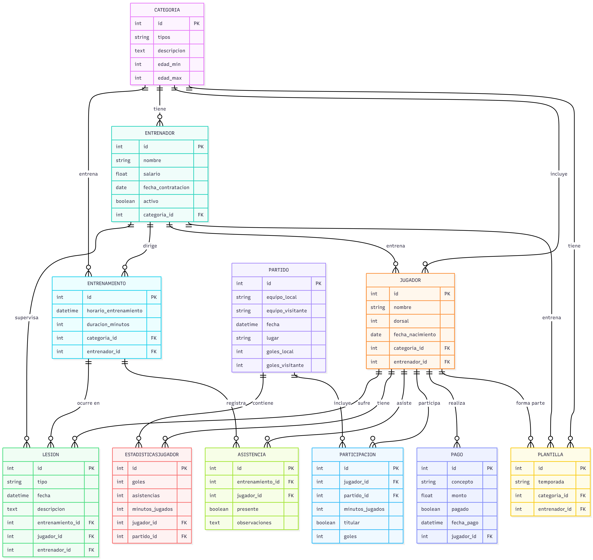

# Gestor de Club Deportivo

Proyecto Django para la gestión de un club deportivo.  
Permitirá administrar jugadores, entrenadores, pagos, partidos y otros elementos del club.

---

## Estado del proyecto

Esta es la **rama de configuración inicial**, que contiene:

- Estructura base del proyecto Django.
- Archivos de configuración (`settings.py`, `urls.py`, `wsgi.py`).
- Ficheros esenciales (`requirements.txt`, `.gitignore`, `manage.py`).

En próximas ramas se incluirán los modelos, datos y backups.

---

# Proyecto Django para la Gestión de un Club Deportivo

Este repositorio contiene la estructura y lógica de datos para administrar un club deportivo: **jugadores**, **entrenadores**, **categorías**, **entrenamientos**, **partidos**, **pagos** y **estadísticas**.

---

## Estado del Proyecto

Esta es la **rama Modelos**, que incluye:

- Definición completa de los modelos principales del club.
- Gestión de relaciones entre las distintas entidades.
- Estructura lista para migraciones y pruebas de integridad de datos.

---

## Modelos Incluidos

A continuación se detallan los modelos definidos, su propósito y las relaciones clave.

---

### Tabla de Modelos

| Modelo              | Propósito                                                    | Relaciones Principales                                         |
| ------------------- | ------------------------------------------------------------ | -------------------------------------------------------------- |
| Categoria           | Define grupos por edad del club                              | Relaciona a jugadores y entrenadores                           |
| Entrenador          | Representa al personal encargado de entrenar                 | Asignado a una categoría y vinculado a jugadores               |
| Jugador             | Datos básicos de los integrantes del club                    | Pertenecen a una categoría, tienen entrenador, juegan partidos |
| Entrenamiento       | Sesiones de práctica del club                                | Relaciona categoría, entrenador y jugadores (con asistencia)   |
| Lesion              | Incidencias de lesiones durante entrenamientos               | Asocia a jugador, entrenador y entrenamiento                   |
| Partido             | Encuentros oficiales del club                                | Involucra jugadores (participación)                            |
| EstadisticasJugador | Registro de goles, asistencias y minutos jugados en partidos | Uno a uno con jugador y partido                                |
| Plantilla           | Agrupación de jugadores por temporada y categoría            | Vincula jugadores, entrenador y categoría                      |
| Pago                | Gestión de cuotas y pagos realizados por los jugadores       | Asociado a un jugador                                          |
| Asistencia          | Control de presencia de jugadores en los entrenamientos      | Intermedio entre entrenamiento y jugador                       |
| Participacion       | Detalle de la participación de jugadores en partidos         | Intermedio entre partido y jugador                             |

---

### Resumen de Relaciones entre Modelos

- **OneToOne:** Un entrenador por categoría; una estadística por jugador y partido; una lesión por jugador.
- **ForeignKey:** Jugadores a Categoría y Entrenador; Entrenamiento a Categoría y Entrenador; Pago a Jugador.
- **ManyToMany:** Jugadores en entrenamientos y partidos (vía modelos intermedios).
- **Modelos Intermedios:**
  - `Asistencia`: rastrea presencia de jugadores en los entrenamientos.
  - `Participacion`: informa minutos, goles y titularidad de jugadores en partidos.

---

## Detalle de Modelos

### Categoria

- **Descripción:** Agrupa jugadores y entrenadores por edad.
- **Campos destacados:** tipos (Benjamín, Alevín, Infantil, etc.), edad_min, edad_max.
- **Relaciones:** Un entrenador y múltiples jugadores pueden pertenecer a una categoría.

### Entrenador

- **Descripción:** Representa a quienes dirigen los entrenamientos.
- **Campos destacados:** nombre, salario, fecha_contratacion, activo.
- **Relaciones:** Uno a uno con una categoría. Relacionado con jugadores y entrenamientos.

### Jugador

- **Descripción:** Identidad y datos personales de los atletas.
- **Campos destacados:** nombre, dorsal, fecha_nacimiento.
- **Relaciones:** Pertenece a una categoría y un entrenador. Participa en entrenamientos y partidos.

### Entrenamiento

- **Descripción:** Sesiones de práctica.
- **Campos destacados:** horario_entrenamiento, duracion_minutos.
- **Relaciones:** Se asocia a una categoría y entrenador. Jugadores participan vía Asistencia.

### Lesion

- **Descripción:** Registro de incidencias durante los entrenamientos.
- **Campos destacados:** tipo, fecha, descripcion.
- **Relaciones:** Relacionado a un jugador, un entrenador y un entrenamiento.

### Partido

- **Descripción:** Gestión de partidos jugados por los equipos del club.
- **Campos destacados:** equipo_local, equipo_visitante, fecha, lugar, goles_local, goles_visitante.
- **Relaciones:** Jugadores participan mediante el modelo Participacion.

### EstadisticasJugador

- **Descripción:** Métricas individuales para cada jugador en cada partido.
- **Campos destacados:** goles, asistencias, minutos_jugados.
- **Relaciones:** Uno a uno con jugador. Relacionado a partido.

### Plantilla

- **Descripción:** Grupo de jugadores y su entrenador para una temporada concreta.
- **Campos destacados:** temporada.
- **Relaciones:** Muchos jugadores y un entrenador por plantilla. Asignación a categoría.

### Pago

- **Descripción:** Control de los pagos realizados por jugadores (cuotas y otros conceptos).
- **Campos destacados:** concepto, monto, fecha_pago, pagado.
- **Relaciones:** Vinculado a un jugador.

---

### Modelos Intermedios (ManyToMany)

#### Asistencia

| Campo         | Descripción                    |
| ------------- | ------------------------------ |
| entrenamiento | Sesión de entrenamiento        |
| jugador       | Jugador que asistió/no asistió |
| presente      | Asistencia confirmada o no     |
| observaciones | Detalles adicionales           |

#### Participacion

| Campo           | Descripción                         |
| --------------- | ----------------------------------- |
| jugador         | Jugador que participó en el partido |
| partido         | Partido específico                  |
| minutos_jugados | Tiempo jugado                       |
| titular         | Si empezó como titular o suplente   |
| goles           | Goles anotados en el partido        |

---

## Diagrama de Entidad-Relación

A continuación se muestra el diagrama de entidad-relación que representa la estructura y las relaciones principales del club deportivo.

El diagrama refleja cómo se vinculan entidades como jugadores, entrenadores, categorías, entrenamientos, partidos, pagos y estadísticas dentro del sistema de gestión del club. Puedes consultar los detalles sobre el significado de cada relación en las secciones anteriores de este README.

---

# Rama Backups – Club Deportivo

Esta rama contiene todo lo necesario para trabajar con las copias de seguridad y la generación de datos de ejemplo del club deportivo en Django.

---

## Estado del Proyecto

La rama **Backups** incluye:

- Seeders para poblar las tablas del proyecto.
- Comando personalizado para crear datos aleatorios con Faker.
- Backup de datos exportado en formato fixture **UTF-8** (compatible y listo para importar en Django).

---

## Flujo de Trabajo y Requisitos

| Paso                        | Descripción                                                                       |
| --------------------------- | --------------------------------------------------------------------------------- |
| Rellenar tablas con seeders | Uso de scripts y utilidades para poblar los modelos del club con datos iniciales. |
| Comando Faker personalizado | Genera **10 objetos aleatorios** por cada modelo usando Faker.                    |
| Backup con fixture en UTF-8 | Exporta todos los datos a un archivo JSON en formato UTF-8 puro.                  |

---

## Exportación de Fixture UTF-8

Dado que los **fixtures** estándar no funcionaban correctamente en tu entorno UFT-16 LE, se creó un proceso alternativo para generar el backup en **UTF-8** puro. Esto evita problemas de codificación.

---

### Código utilizado para la exportación

Guarda este script como `club/export_club.py`:
